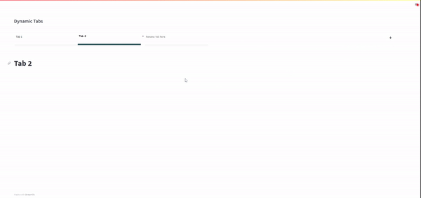

# streamlit-dynamic-tabs
Create and close tabs




If your users already have tabs, load them up when the app loads:


Mobile support - more compact and bouncy add tab button interaction


This is a component that helps users make and close tabs dynamically. The tab titles and subsequent content can be collated into a list of dictionaries, saved and recalled for users to view as when they need it (of course you would have to create this part yourself but the component allows for this).

Possibilities:
- Can add saved tab titles to be loaded up for users to view their previously saved tabs
- Change the add button via material ui icons (google)
- Can limit the number of tabs a user can create
- Can change the design of the tabs
- When there is only one tab, the close button does not appear. This is because upon creating a new tab, the tab is active but value is not passed onto streamlit. So create some code to direct users to click on the tab to view content. Wanted to limited the use of Streamlit's api to send values to the python as it creates buggy behvaiour in the component. 

Its built on the streamlit custom components typescript template

To install it:

`pip install streamlit-dynamic-tabs`

**Variables**

- tabTitle: list of dictionaries [{'title':''}]
- addIcon: The icon used to represent the add new tab button [material icons from google](https://fonts.google.com/icons)
- limitTabs: Whether or not you want to limit the number of tabs that can be created (Boolean)
- numOfTabs: The number of tabs that can be made if 'limitTabs' variable is True
- styles: CSS designs you wish to apply to tabs (follow the style.css file here as a guide for what can be changed)

I am yet to use the react funcitonality to adjust the iframe as per the streamlit documentation - lazy on my part. For now please download and place the [iFrame.css](https://github.com/Socvest/streamlit-dynamic-tabs/tree/main/dynamic_tabs) file and import it in your app file. 

Examples:

```
import streamlit as st
import time
st.set_page_config(layout="wide")

st.subheader("Dynamic Tabs")
st.markdown('<style>' + open('./iFrame.css').read() + '</style>', unsafe_allow_html=True)

# If you wish to load up already existing tabs, load them from a database. Below is just a mock up.
existing_tabs = [{'title':'Tab 1'}, {'title':'Tab 2'}]

# if you wisht to styyle it according to your own specs:
styles = {'dynamic-tabs':{'':''}}
          'all-tabs':{'':''}}
          'individual-tab-container':{'':''}}
          'tab-selected':{'':''}}
          'title-close-save-button-container':{'':''}}
          'title-of-tab':{'':''}}
          'save-button-container':{'':''}}
          'close-btn-container':{'':''}}
          'new-tab-btn-container':{'':''}}
 
d_tabs = dynamic_tabs(tabTitle=existing_tabs, limitTabs=False, numOfTabs=0, styles=None, key="foo")

A main issue with the streamlit components is the component keeps remounting if its clicked rapidly. Its not that bad though and can be avoided generally. Just input some features into your app that prevents this behvaviour from your users. I used the time.sleep which is demonstrated below. 
     
if d_tabs == 0:
    time.sleep(1)
    st.info("""Click on a tab to view contents \n - Name tab by clicking in the input area \n - After renaming, click save to save the tab's title \n - To close the tab, hover over the tab click the close button that slides out""")
  st.stop()
    
elif d_tabs['title'] == "":
    time.sleep(1)
    st.title("New Tab")

else:
    time.sleep(1)
    st.title(d_tabs['title'])
    
    if d_tabs['title'] == {insert tab title here} <for example st.session_state['foo']['title']>:
        st.write(f"Inside tab {st.session_state['foo']['title']")
     
```


